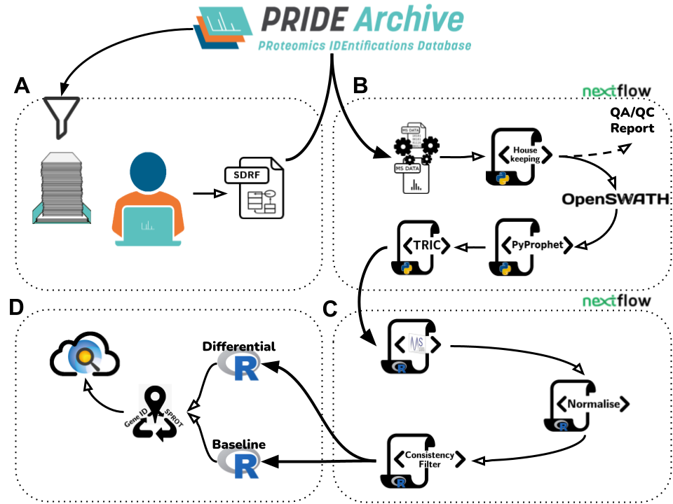

# Welcome to the PRIDE DIA reanalysis pipeline project
This repository contains the workflows and protocols needed to reanalyse public DIA datasets from the [PRIDEArchive](https://www.ebi.ac.uk/pride/archive)

## The pipeline

### Abstract 

Among the large amount of proteomics data that is made available in public domain, data coming from DIA (Data Independent Acquisition) and SWATH-MS methods in particular, are becoming increasingly popular. However, their re-use is still limited, due to different reasons. We here introduce a (re-) analysis pipeline for SWATH-MS data, which includes a harmonised combination of metadata annotation protocols, automated workflows for MS data and statistical analysis, and integration of the results into Expression Atlas. The individual steps of the pipeline, orchestrated using Nextflow, are designed with open proteomics software tools and are fully containerised to make the pipeline readily available, reproducible and easy to update.  

Using this software we reanalysed 10 PRIDE public DIA datasets, amounting to 1,278 individual SWATH-MS runs. We then ensured the robustness of the analysis and compared the obtained results with those included in the original publications. The final results were integrated into Expression Atlas, making quantitative results from SWATH-MS experiments more widely available, integrated with results coming from other reanalysed proteomics and transcriptomics datasets. 

The pipeline consists of 4 parts, 
A) data selection and curation
B) automated DIA data analysis nextflow
C) statistical analysis nextflow
D) postprocessing and presentation 

Each step has its own software requirements. The necessary analysis software is conainterised, their versions harmonised for a seamless integration of the individual pipeline parts.

| Step                             | Name                                          | URL or  DockerHub handle                                                                                                                                              | Version             |
| -------------------------------- | --------------------------------------------- | ------------------------------------------------------------------------------------------------------------------------------------------------------------------------ | ------------------- |
| Conversion from raw file to mzML | wiffConverter                                 | sciex/ wiffconverter:0.7                                                                                                                                              | 0.7.0               |
| QC/QA                            | yamato                                        | [https://github.com/PaulBrack/Yamato/releases/download/v1.0.4/release-linux-x64.zip](https://github.com/PaulBrack/Yamato/releases/download/v1.0.4/release-linux-x64.zip) | 1.0.4               |
| Window management                | python scripts                                | [https://github.com/PRIDE-reanalysis/DIA-reanalysis](https://github.com/PRIDE-reanalysis/DIA-reanalysis)                                                                 | 1.0.0               |
| OpenSWATH                        | OpenSWATH                                  | openswath/ Openswath:0.1.2                                                                                                                                            | 2.4.0 (git 868546e) |
| PyProphet                   | 2.0.dev1 (git ddcedac)                        |
| TRIC                        | msproteomicstools  0.8.0  (git eeed765) |
| Post-processing                  | R                                         | [https://github.com/PRIDE-reanalysis/DIA-reanalysis](https://github.com/PRIDE-reanalysis/DIA-reanalysis)                                                                 | 4.0.3               |
| MSstats                      | 3.22.0                                        |
| MyGene.info                  | 1.24.0, Ensembl 99/GRCh38                     |

## The repository
Since software requirements for the pipeline are overlapping and pipeline steps are probably conducted in different environments, the repository is structured such that, once checked out, it can be bootstrapped easiest for _use_ in the respective pipeline part.
A) Data curation protocols and documentation are found in [doc/](doc/)
B+C) Workflows are found in [nextflows/](nextflows/), corresponding documentation in [doc/nextflows-documentation](doc/nextflows-documentation). Example configuration and input files are found in [inputs/](inputs/). Container recipes for used containers are found in [container/](container/), upstream for B) and downstream for C) respectively. 
D) Software and scripts for postprocessing, result inspection and visualisation can be found in [container/postprocess](container/postprocess). For this, we suggest use of the R/ folder to start the containerised R environment in. 

