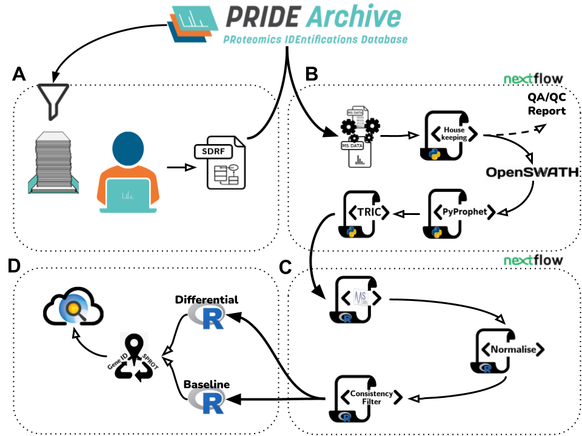

# Pipeline documentation

### Abstract 

Among the large amount of proteomics data that is made available in public domain, data coming from DIA (Data Independent Acquisition) and SWATH-MS methods in particular, are becoming increasingly popular. However, their re-use is still limited, due to different reasons. We here introduce a (re-) analysis pipeline for SWATH-MS data, which includes a harmonised combination of metadata annotation protocols, automated workflows for MS data and statistical analysis, and integration of the results into Expression Atlas. The individual steps of the pipeline, orchestrated using Nextflow, are designed with open proteomics software tools and are fully containerised to make the pipeline readily available, reproducible and easy to update.

Using this software we reanalysed 10 PRIDE public DIA datasets, amounting to 1,278 individual SWATH-MS runs. We then ensured the robustness of the analysis and compared the obtained results with those included in the original publications. The final results were integrated into Expression Atlas, making quantitative results from SWATH-MS experiments more widely available, integrated with results coming from other reanalysed proteomics and transcriptomics datasets. 

The pipeline consists of 4 parts, 
A) data selection and curation
B) automated DIA data analysis nextflow
C) statistical analysis nextflow
D) postprocessing and presentation 

## Documentation structure
Documentation for A) can be found in [data/](data/), nextflow specific documentation can be found in [nextflows-documentation/](nextflows-documentation/), images for the documentation or repo markdown go in [images/](images/), container specific information in [containers/](containers/). 
